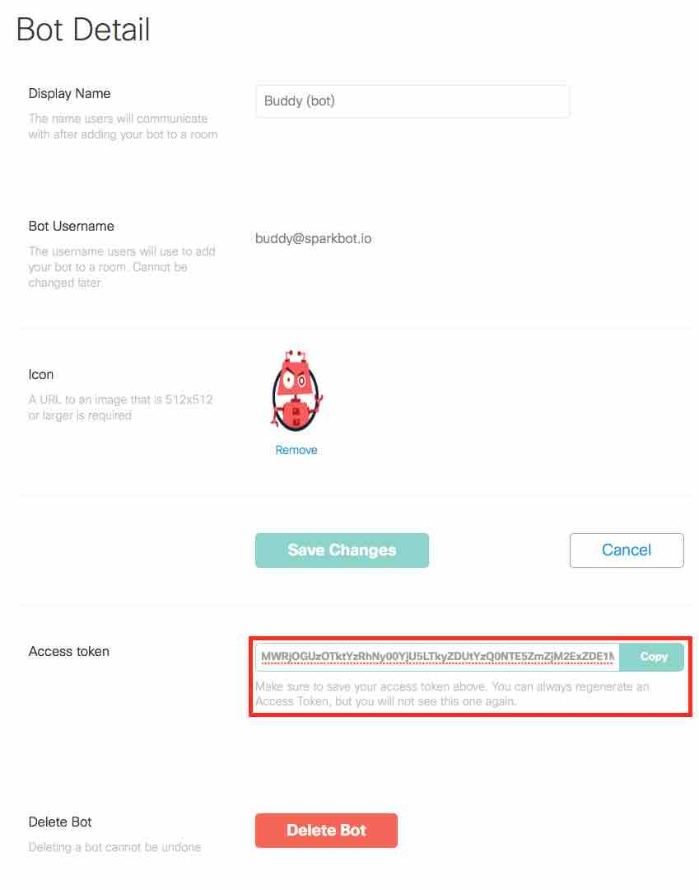
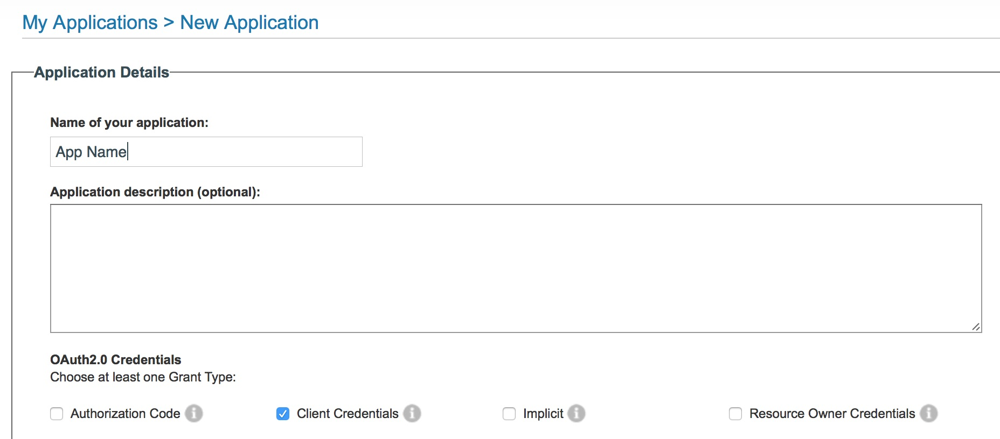
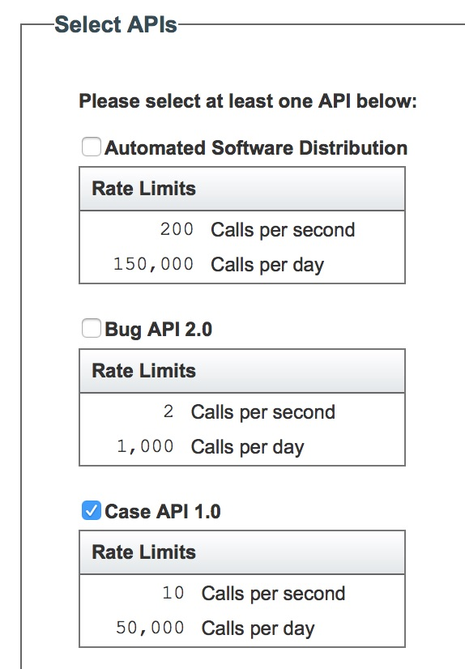
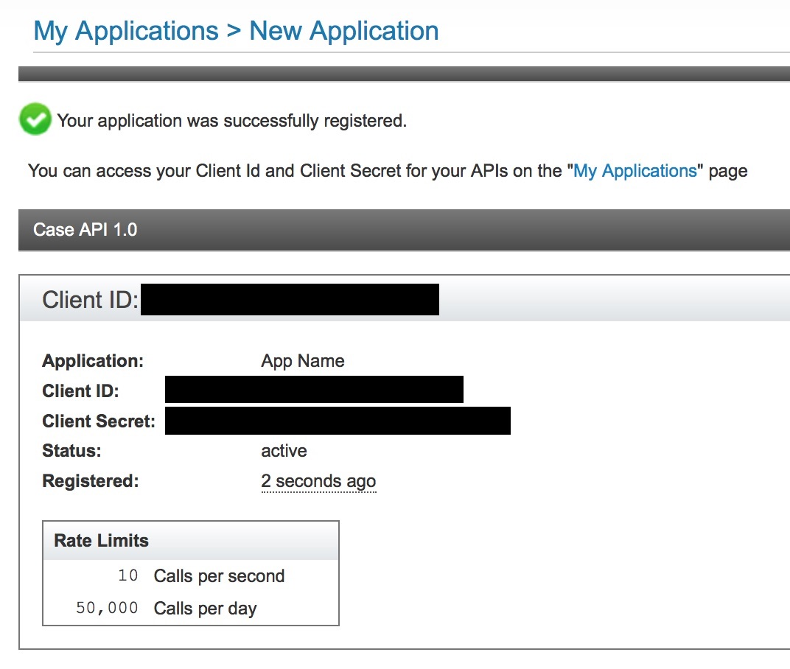
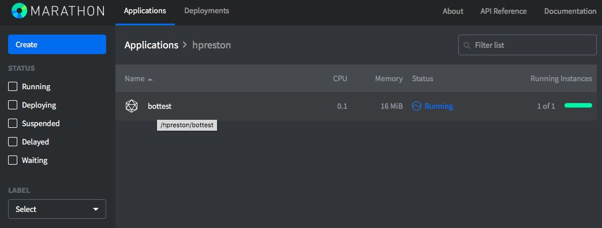

# TAC Bot

## Description

TAC Bot is a Spark Bot [ciscospark.com](http://www.ciscospark.com). Spark is a business messaging platform that supports persistent chat, voice and video calling, file sharing, and virtual whiteboards. The Spark platform is open and extensible through a rich set of APIs which the any Spark Bot, like *TAC Bot*, will use a webhook to receive all messages sent to the Bot, and will "listen" for a specific set of command words. When a command is received, it will perform an action basec on the command.  Any other message sent to the bot will result in the help message being sent back. 

It is intended to facilitate communications related to Cisco [TAC](http://www.cisco.com/go/tac) case management, including escalations communications, progress updates, next steps. It is not intended to replace traditional TAC tools such as email, file publishing, BE escalation requests, etc, but to enhance communications between TAC engineers, escalation teams, sales engineers, and the customer.

What is it intended to do?
* Enhance communication between individuals below
    * TAC Customer Support Engineers (CSE)
    * TAC Escalation Engineers
    * Account Team Systems Engineers
    * Advanced Services HTOMs & NCEs
    * PSTS (Post Sales Technical Support) Engineers
    * Customers
* Reduce case-related email clutter 
* Shorten case duration through enhanced communication 
* Increase customer satisfaction through enhanced communication and shorter case durations

What is it NOT intended to do?
* NOT intended to be a replacement for existing TAC tools:
    * Logged email communications
    * File publishing tools
    * BE escalation procedures 
* NOT intended to be used to store customer-sensitive case data/configs

## How to use

You can use TAC Bot by simply inviting **tac@sparkbot.io** to your Spark room.

Or you can start a conversation with TAC bot by accessing the following URL. 
```
# Remember to replace <EMAIL> with your email address
http://imapex-tac-bot-mbrainar.green.browndogtech.com/hello/<EMAIL>
```

### Commands supported today

Most commands will accept a case number following the command and will return the data for that case number. If no case number is provided, the Bot will look in the name of the Spark room to which it is a part, and will use a case number if found there.

* **/title:** Get title for TAC case.
* **/description:** Get problem description for the TAC case.
* **/owner:** Get case owner (TAC CSE) for TAC case.
* **/contract:** Get contract number associated with the TAC case.
* **/customer:** Get customer contact info for the TAC case.
* **/status:** Get status and severity for the TAC case.
* **/rma:** Get list of RMAs associated with TAC case.
* **/bug:** Get list of Bugs associated with TAC case.
* **/device:** Get serial number and hostname for the device on which the TAC case was opened
* **/created:** Get the date on which the TAC case was created, and calculate the open duration
* **/updated:** Get the date on which the TAC case was last updated, and calculate the time since last update
* **/link:** Get link to the case in Support Case Manager
* **/feedback:** Sends feedback to development team; use this to submit feature requests and bugs
* **/help:** Get help.

### Automated room creation

TAC Bot has an API that can be used to create a room for a TAC case and invite a user. To use this API, create an HTTP GET call to the URL of the Bot for example: 
```
# Be sure to replace <CASE#> and <EMAIL> with real values
http://imapex-tac-bot-mbrainar.green.browndogtech.com/create/<CASE#>/<EMAIL>
```
The plan is to use this API to automatically create these cases by sending an emails to an email service that will call this API. The project for the email service can be found at [github.com/imapex/tacbot-email](http://github.com/imapex/tacbot-email).

# Contribute

If you wish to contribute to TAC Bot, the instructions below should help to get a Bot running so that you can code, test and contribute.

## Create your Bot 
You need to create a new Bot App account to use for your testing. Here are the basic instructions.  

1.  Log into [developer.ciscospark.com](https://developer.ciscospark.com) with your own personal Spark account.  
2. Click on **My Apps** in the top menu, and create a new **Bot** (do not create a new integration).  

	
	---
	
	
3. Provide a *Display Name*, *Bot Username*, and *Icon* URL for your new bot.  The *Bot Username* needs to be unique within Spark, and can **NOT** be changed.  Click **Add Bot**

	
	
4. Record the *Access token* that is displayed on the next page, and **Save Changes**.  If you do NOT copy the token, you can regenerate it.  

	
	
5. Also note the **Bot Username** that is displayed.  This is the ***Bot Email*** that will be needed when setting up your boilerplate code.  

## CASE API Access

You will need to gain access to the Case API through [apiconsole.cisco.com](http://apiconsole.cisco.com).

1. Log in to [apiconsole.cisco.com](http://apiconsole.cisco.com).
2. Click on **My APIs** in the top menu. Find **Case API 1.0** in the list and click on the **Register** button on the right.
    
    

    If you do not see Case API 1.0 listed in your "My APIs", you will need to email [ssapi-pilot-help@external.cisco.com](mailto:ssapi-pilot-help@external.cisco.com) to request access to the API.
3. Provide an *App Name*, *Description* is optional, and select *Client Credentials* under OAuth2.0 Credentials.
    
    
    
    Ensure that *Case API 1.0* is selected in the list of available APIs to which this app requires access.
    
    
    
    Check the *I agree to the terms of service* and click **Register**
4. Record the *Client ID* and *Client Secret* for your app. You will need these in the deployment process later. 

    

## GitHub and Local Repository Setup

1. Fork the repo
    
    [https://github.com/imapex/tac-bot#fork-destination-box](https://github.com/imapex/tac-bot#fork-destination-box)
    
2. Clone the repo
    
    ```
    #Replace <NAME> with your data
    git clone https://github.com/<GITHUB REPO>.git
    ```
    
## Build and Push Initial Docker Image

1. Build the base bot

    ```
    # Set a couple environment variables to make commands easier
    # Replace the <NAME> with your data
    export BOT_REPO=<GITHUB REPO>
    export BOT_NAME=<YOUR BOT NAME>
    export DOCKER_USER=<DOCKER HUB USERNAME>
    
    # If you aren't in your new Git Repository directory, change into it 
    cd $BOT_REPO
    
    # Build a Docker image
    docker build -t $DOCKER_USER/$BOT_REPO:latest .
    ```
    
2. Push the image to Docker Hub
    * You will need to have logged into Docker Hub on your workstation for this step.  If you haven't done so, you can by running: 

        ```
        docker login 
        ```

    ```
    docker push $DOCKER_USER/$BOT_REPO:latest
    ```

## Deploy your Bot

### Mantl.io
These steps will deploy your bot to the Cisco DevNet Mantl Sandbox.  This is just one option that is freely available to use, however you can deploy your bot to any infrastructure that meets these requirements:

* Able to run a Docker Container
* Provides a URL for inbound access to running containers from the Internet
    * *Spark needs to be able to reach it with WebHooks*

There is another provided install script *bot_install_mantl.sh* that will let you dynamically define your mantl instance, and will also store environment variables in the JSON file that is sent to create the bot and are therefore stored in Mantl.

1. Deploy your Bot.  
    
    ```
    # From the root of your project... 
    cd setup_and_install 
    	
    # Run the install script
    ./bot_install_sandbox.sh 
    ```
    
    * Answer the questions asked
    * When complete, you should see a message that looks like this

    ```
    Your bot is deployed to 

    http://<DOCKER USERNAME>-<BOT NAME>.app.mantldevnetsandbox.com/
    
    You should be able to send a message to yourself from the bot by using this call
    
    curl http://<DOCKER USERNAME>-<BOT NAME>.app.mantldevnetsandbox.com/hello/<YOUR EMAIL ADDRESS>
    
    You can also watch the progress from the GUI at: 
    
    https://mantlsandbox.cisco.com/marathon
    ``` 
        
2. Test that your bot is working by executing the `curl` command shown in your output.  If successfully deployed, you will recieve a message in Spark from your bot.   
3. Reply back to your bot and verify that the default commands are working.  
    * `/help` - should return a help message 
    * `/echo Spark Bots are Awesome!` - should reply back with `Spark Bots are Awesome!`

4. Make changes to the Bot via bot/bot.py

5. Update Bot:  Build and Push a new Docker Image

    ```
    # If you've opened a new terminal since setting before
    export BOT_REPO=<GITHUB REPO>
    export BOT_NAME=<YOUR BOT NAME>
    export DOCKER_USER=<DOCKER HUB USERNAME>

    
    # Build a Docker image
    docker build -t $DOCKER_USER/$BOT_REPO:latest .
    docker push $DOCKER_USER/$BOT_REPO:latest
    ```

6. Restart your Bot in the DevNet Sandbox.  Two options for this. 
    * Through the Marathon GUI
        1. Login to Marathon at [https://mantlsandbox.cisco.com/marathon/](https://mantlsandbox.cisco.com/marathon/)
            * Username/Password: admin/1vtG@lw@y
        2. Find your running Application.  It will be in a folder matching your Docker Username.  
            
        3. Click on your application, and then click **Restart**
            
        4. Wait until the new task shows as **Healthy** 
    * Using the API 
        1. Use this curl command to restart your application through the API.  

            ```
            curl -kX POST \
                -H "content-type: application/json" \
                -u admin:1vtG@lw@y \
                https://mantlsandbox.cisco.com/marathon/v2/apps/$DOCKER_USER/$BOT_NAME/restart?force=true
            ```

        2. Use this curl command to check the status of the deployment.  

            ```
            curl -kX GET \
                -u admin:1vtG@lw@y \
                https://mantlsandbox.cisco.com/marathon/v2/apps/$DOCKER_USER/$BOT_NAME \
                | python -m json.tool \
                | egrep "tasksHealthy|tasksRunning|tasksStaged"
                
            # Wait until output matches this (1 Healthy, 1 Running, and 0 Staged)
            "tasksHealthy": 1,
            "tasksRunning": 1,
            "tasksStaged": 0,
            ```
            
7. Reconfigure the bot with Spark Account Details
    
    **If using the Cisco DevNet Sandbox (or another Mantl instance where environment variables are not being stored) then it will be necessary to reconfigure the bot with Spark Account Details**

    1. Provide them via a REST API call after the bot code starts up. 

        ```
        # Store the application details as Variables for easier API request building
        export DOCKER_USER=<DOCKER USERNAME>
        export BOT_NAME=<YOUR BOT NAME>
        export SPARK_EMAIL=<SPARK BOT EMAIL>
        export SPARK_TOKEN=<SPARK BOT TOKEN>
        
        curl -X POST \
            http://$DOCKER_USER-$BOT_NAME.app.mantldevnetsandbox.com/config \
            -d '{"SPARK_BOT_TOKEN": "'$SPARK_TOKEN'", "SPARK_BOT_EMAIL": "'$SPARK_EMAIL'"}'         
        ```    

    2. Configuration Update Script

        A bash script is included in the `setup_and_install` directory that will do the configuration update for you.  
        ```
        cd setup_and_install
        ./bot_config.sh
        ```
        
        Completed Configuration script message example:
        
        ```
        Checking if Bot is up
        HTTP Status: 200

        Bot is up.  Configuring Spark.
        Bot Configuration:
        {"SPARK_BOT_TOKEN": "REDACTED", "SPARKBOT_APP_NAME": "<BOT NAME>", "SPARK_BOT_URL": "http://<DOCKER USER>-<BOT NAME>.app.mantldevnetsandbox.com", "SPARK_BOT_EMAIL": "angelbot@sparkbot.io"}
        ```

### Local Deployment

The bot is designed to be deployed as a Docker Container, and can run on any platform supporting Docker Containers.  

**NOTE:** For full functionality, this bot needs to be installed in an environment where the bot application is available on the public internet in order for the Spark Cloud to be able to send WebHooks to the bot.  If you do NOT have an environment to use, the DevNet Sandbox Mantl cluster can be leveraged to host your bot. 

Alternatively, you can use something like [ngrok](http://ngrock.com) to create a secure tunnel to your development environment. This service will give you a publicly accessible URL that you can use as the **SPARK_BOT_URL** parameter.  

#### Running Python Code Locally 

There are several pieces of information needed to run this application.  These details are provided Environment Variables to the application.
**Be sure to use valid details for the environment variables**

If you are running the python application directly, you can set them like this:

```
# Details on the Cisco Spark Account to Use
export SPARK_BOT_EMAIL=myhero.demo@domain.com
export SPARK_BOT_TOKEN=adfiafdadfadfaij12321kaf

# Public Address and Name for the Spark Bot Application
export SPARK_BOT_URL=http://myhero-spark.mantl.domain.com
export SPARK_BOT_APP_NAME="imapex bot"

# Start the bot
python bot/bot.py

```

#### Locally building and running the Docker Container 

There are several pieces of information needed to run this application.  These details are provided Environment Variables to the application.
**Be sure to use valid details for the environment variables**

You can build and run the Spark Bot as a Docker Container locally with these commands.  

```
docker build -t sparkbot .
docker run -it --name sparkbot \
   -p 5000:5000 \
	-e "SPARK_BOT_EMAIL=myhero.demo@domain.com" \
	-e "SPARK_BOT_TOKEN=adfiafdadfadfaij12321kaf" \
	-e "SPARK_BOT_URL=http://myhero-spark.mantl.domain.com" \
	-e "SPARK_BOT_APP_NAME='imapex bot'" \
	sparkbot
```

## Develop with us

If you'd like to contribute to this project with bug fixes or enhancements, we welcome you to the team.  Follow the steps above to get started, make your improvements, and send us a Pull Request.  

### Linting

We use flake 8 to lint our code. Please keep the repository clean by running:

    flake8

### Testing

The IMAPEX team should attempt to have unittests with  100% code coverage. An example test suite is contained
within the tests.py file for the boilerplate application

The tests are can be run in the following ways::

    python testing.py


When adding additional code or making changes to the project, please ensure that unit tests are added to cover the
new functionality and that the entire test suite is run against the project before submitting the code.
Minimal code coverage can be verified using tools such as coverage.py.

For instance, after installing coverage.py, the toolkit can be run with the command::

    coverage run testing.py

and an HTML report of the code coverage can be generated with the command::

    coverage html


